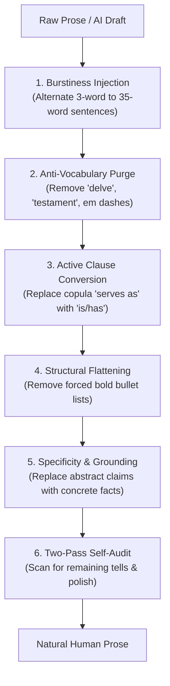

# Humanizer: Anti-AI Writing & Natural Voice Skill

Identify and strip signs of AI-generated prose, apply statistical humanization levers (burstiness, perplexity variance, active voice, specificity insertion), and ensure documentation and writing sound natural, human, and direct.

Based on empirical LLM text detection literature (2024–2026) and observation of thousands of AI writing instances (Mitchell et al., Sadasivan et al., Liang et al., Wikipedia AI Cleanup).

## When to Use

Apply this skill whenever:
- Writing or editing documentation, READMEs, tutorials, how-tos, or release notes
- The user asks to "humanize", "de-AI", "de-slop", or rewrite prose to sound natural
- Reviewing PR descriptions, commit messages, or external posts for AI tells before publishing

## Core Humanization Levers

1. **Burstiness Injection:** Vary sentence length dynamically. Mix short punchy statements (3–6 words) with longer flowing clauses (25–35 words). Avoid uniform 15–20 word sentence pacing.
2. **Anti-Vocabulary & N-Gram Purge:** Remove overused AI words (`delve`, `leverage`, `utilize`, `robust`, `comprehensive`, `streamline`, `foster`, `facilitate`, `pivotal`, `nuanced`, `multifaceted`, `crucial`, `enduring`, `garner`, `valuable`, `vibrant`, `tapestry`, `testament`, `underscores`, `highlights`).
3. **Zero Em Dash Rule:** Eliminate em dashes (`—`) or cap at 1 per 1,000 words. Replace with commas, parentheses, or separate sentences.
4. **Active Clause Conversion:** Avoid copula avoidance (`serves as`, `stands as`, `boasts`, `functions as`). Use simple active verbs (`is`, `has`, `runs`).
5. **Structural Flattening:** Reframe artificial bullet lists and title-cased headers into flowing sentences. Avoid restating points in "In conclusion" sections.
6. **Specificity & Grounding:** Swap abstract generalizations ("improves performance and streamlines operations") with concrete details ("reduces query latency from 120ms to 9ms").
7. **Two-Pass Self-Audit Protocol:**
   - **Pass 1:** Rewrite text applying levers 1–5.
   - **Pass 2:** Ask *"What makes this still sound like an LLM?"* Identify lingering artifacts and perform final polish.

## Quick Rules

- **NO filler connectors:** Drop "Additionally," "Furthermore," "At its core," "In today's fast-paced world."
- **NO negative parallelisms:** Replace "Not only... but also..." with direct active statements.
- **NO colon-header bullet points:** `- **Feature:** Explanation` -> write direct prose or plain tables.

## Gotchas

- **First-pass model bias:** The model that wrote the original draft often misses its own AI tells during a single edit pass. Always execute Pass 2 explicitly by asking *"What makes this still sound like an LLM?"*
- **Em-dashes sneak back in:** Models trained on RLHF prose naturally insert em-dashes (`—`). Treat em-dashes as compile-time errors and strip them during Pass 2.
- **Preserve technical precision:** Humanizing prose means removing empty buzzwords (`delve`, `pivotal`, `testament`), NOT removing required technical terms, code snippets, or precise parameters.
