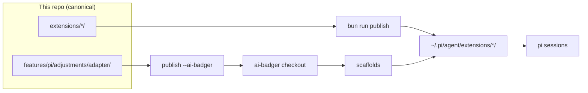

# pi-badger-integration

Opinionated pi extensions that pair with [ai-badger](https://github.com/Arasz/ai-badger), plus the publish flow that installs them.

If you run pi with ai-badger scaffolds, install this set. It gives every pi session background delegation, predicate monitors, free-model fallback on router failure, cron scheduling, and MCP tools.



## Install

```bash
git clone https://github.com/Arasz/pi-badger-integration
cd pi-badger-integration
bun install
bun run publish
bun run check
```

`check` must exit 0. Steps with verification and removal live in [Install extensions](docs/howto/install-extensions.md).

## What you get

| Extension | What it adds |
|---|---|
| subagent | Background delegation to ai-badger personas (`delegate`, `delegations`, `queue`) |
| monitor | One-shot predicate monitors and the idle `wait` tool (`monitor`, `/monitors`) |
| router-fallback | Session-only fallback over Groq, Gemini, OpenRouter `:free` on router failure (`/fallback`) |
| pi-cron | Cron scheduling inside pi |
| pi-mcp-tools | Universal MCP tools |
| session-signals | Marker importance aborts and delegation footer status |
| shift-enter-newline | Shift+Enter newline for terminals that cannot report it |
| ai-badger hooks adapter | PreToolUse gates and PostToolUse arms (vendored into ai-badger) |

Details sit in the [extension catalog](docs/reference/extension-catalog.md). Provider keys for the fallback chain are covered in [Configure provider keys](docs/howto/configure-provider-keys.md).

## Commands

```bash
bun install        # one-time
bun test           # every extension this repo owns, fully unit-covered
bun run check      # drift report, exit 1 on any
bun run publish    # install canonical to user scope
bunx tsc --noEmit -p .
```

How the publish flow works and why the adapter vendoring step cannot be skipped: [Publish flow](docs/explanation/publish-flow.md).

## Contributing

Small project, real gates. Read [CONTRIBUTING.md](CONTRIBUTING.md) once before your first change. Security reports go through [SECURITY.md](SECURITY.md), never a public issue.

License: [MIT](LICENSE).
