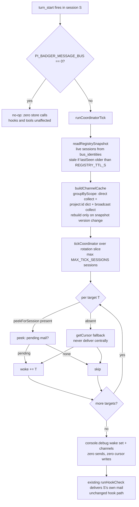

# How the message coordinator works

Goal: understand the centralized wake-only coordinator that sits in front of the message-bus hooks — what runs on every turn, what it reads, what it never touches, and how to observe or disable it.

## Big picture

Delivery still happens the proven way: each session's `session_start` / `turn_start` hooks read that session's own mail (`peek-then-post-then-advance`) and the adapter poll timer wakes idle sessions. The coordinator adds one centralized, read-only pass per turn: it looks at **who is alive** (registry), **what mail is pending for whom** (peek per session), and logs the wake set to `console.debug`. It sends nothing, settles no cursors, writes no acks. Hooks remain the delivery leg; the coordinator is observability plus the seam a future delivery leg will plug into.

Source: `extensions/message-bus/coordinator.ts` (tick), `coordinator-group.ts` (grouping + cache), `message-bus-core.ts` (shared constants/types), `index.ts` (registry block + wire-in block).

## Logic flow



Key invariants visible in the diagram:

- **Read-only.** No box writes mail, settles a cursor, or sends an ack. The tick fails on `deliver*`/`send`/`sendMessage`/`appendEntry` by test pin.
- **Fail-open per target.** One session's peek throwing records an error slot; every other session is still decided; overlapping ticks collapse to one flight (keyed by snapshot version + budget).
- **Piggyback, not a daemon.** There is no background process: the pass runs inside a live session's turn. Nothing wakes a fully idle machine — that is struck by design (no durable-tick host exists in pi), and the adapter poll timer remains the idle wake.
- **Kill-switch stops the loop, never the tools.** `"0"` disables hooks, heartbeat, and tick; `send`/`list`/`check`/`ack`/`reply`/`whoami` keep answering.

## The moving parts

| Piece | Where | What it does |
|---|---|---|
| Registry heartbeat | `index.ts` (`touchRegistry`) | Best-effort upsert on `session_start` (forced) + throttled touch (≤1 per TTL/4) on turns/checks; early-returns under kill-switch. No DDL change — expiry is a read-side filter. |
| Snapshot + version | `readRegistrySnapshot`, `registryVersion` | `{entries, version}` with `version = max(lastSeen):count:identity-hash`, so membership swaps bust the cache. |
| Grouping + cache | `groupByScope`, `buildChannelCache` | Broadcast collect + per-project dict keyed on per-read `projectId`; project-less sessions group directs only. Recompute runs only on version change (the per-turn preview fetch is lazy). |
| Tick | `tickCoordinator` | Sequential per-target peek (concurrency 1 suits the `busy_timeout=5000` store), round-robin past `MAX_TICK_SESSIONS` with `truncated` flag, `{woke, errors, truncated, disabled}` result. |
| Wire-in | `index.ts` new `turn_start` block | Separate handler after the delivery hook; imports + appended block only, hook bodies untouched. |

Placeholders (measurement TODOs, not tuned): `REGISTRY_TTL_S=300`, `MAX_TICK_SESSIONS=25`.

## Observe it

The tick logs one `console.debug` line per turn with the wake set and channel summary. To confirm it runs without affecting delivery, compare two turns: the debug names sessions with pending mail, while each session's cursor only moves through its own hook delivery (`/messages check`).

## Disable it

```bash
export PI_BADGER_MESSAGE_BUS=0
```

Disables hooks, heartbeat, and tick. The `message-bus` tool and `/messages` keep working. Unset and the next `session_start` re-arms normally.

## What is deliberately not built

Mailbox central delivery, hook deletion, ack-wait/retry/unavailable (acks are voluntary broadcast stubs — no transport receipt to wait on), and socket/process wake. See the plan record `docs/work/2026-09-09-centralized-delivery-coordinator-plan.md` for the evidence and the gated follow-ups.
